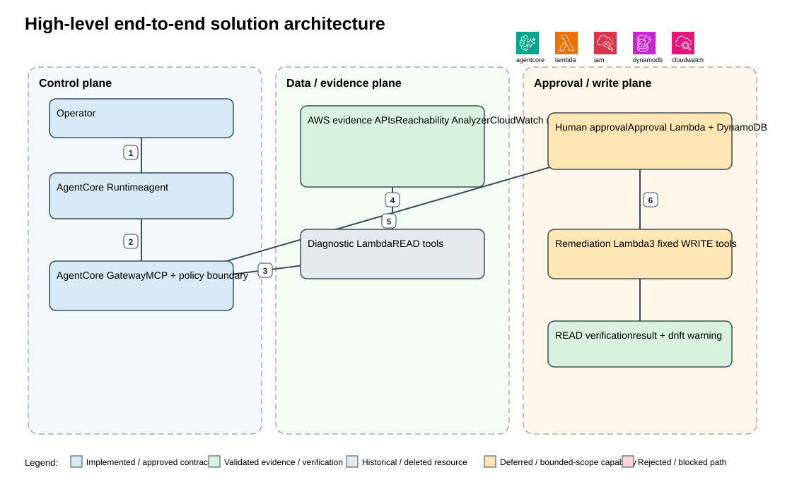
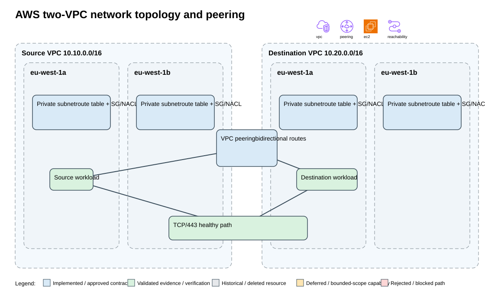
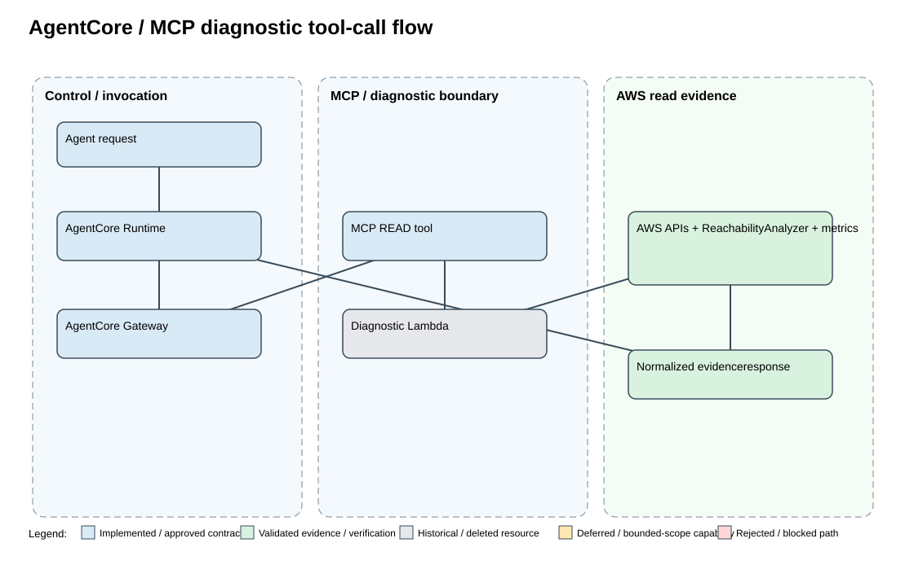
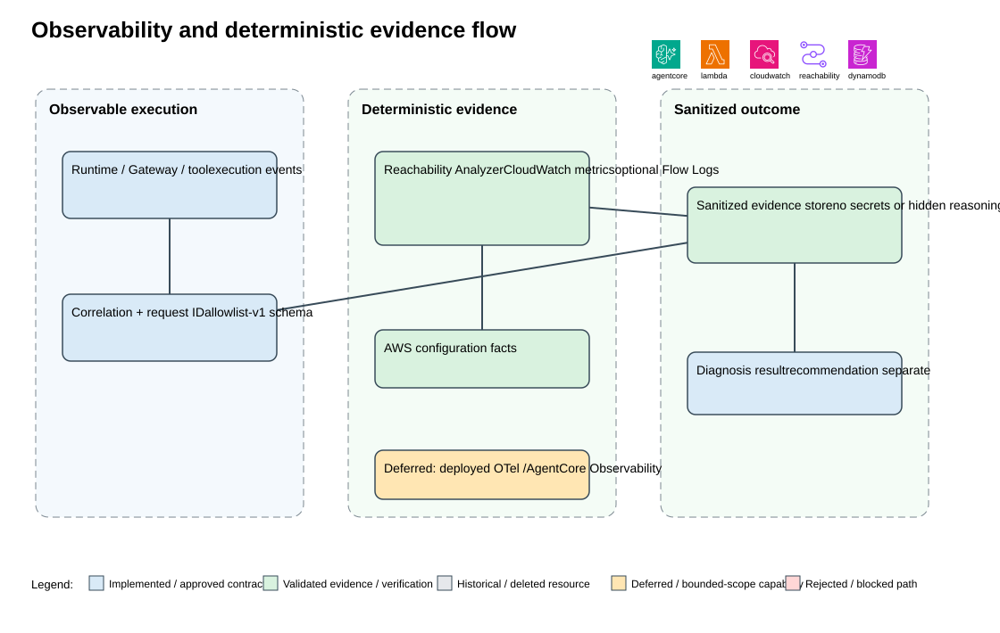
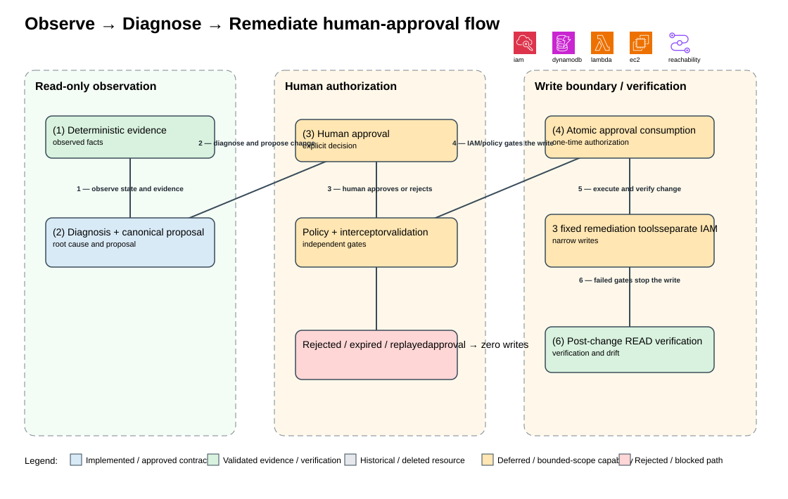

# Agentic AWS Network Operations

A portfolio project for explainable AWS network diagnosis using deterministic cloud evidence, Amazon Bedrock AgentCore, MCP tooling, and human-controlled remediation boundaries.

## Project Status and Achievements

**Phase 13 is complete under a private-repository scope.**

The project delivered a reproducible Terraform-based AWS network lab with two VPCs,
VPC peering, deterministic diagnostics, AgentCore/MCP integration, bounded remediation
workflows, observability contracts, architecture diagrams, and career/demo materials.

All temporary AWS resources were torn down and Terraform state is empty. Detailed
teardown, evidence, limitations, and delayed billing verification are documented in
the [project status](PROJECT_STATUS.md) and [Phase 11 teardown report](docs/architecture/phase-11-teardown-preflight.md).

README and technical documentation are complete for controlled private sharing. The screenshot strategy is intentionally conservative: raw AWS screenshots remain outside the repository in the private desktop folder, and no raw or sanitized screenshots are copied or committed at this time. Screenshots are optional private/demo evidence rather than required repository deliverables. Reproducibility relies on Terraform source, sanitized JSON evidence, Markdown documentation, tests, and editable architecture diagrams. Public repository publication remains deferred and is not required.

Phase 7 also retains a documented limitation: CloudWatch metrics were validated, but live Flow Logs/CloudWatch Logs traffic evidence was not obtained because the project EC2 instances have no IAM instance profiles or SSM readiness. No live Flow Log record or Logs Insights query is claimed.

The delivered architecture and foundation include:

- Two private VPCs with private subnets, controlled routes, security groups, NACLs, and VPC peering.
- Terraform-managed network and lab foundations with deterministic validation evidence.
- An AgentCore Runtime/Gateway design with historical deployed MCP Gateway/Runtime evidence; those separately managed resources were removed during Phase 11 cleanup.
- A diagnostic Lambda behind MCP tools for structured, read-only network observation.
- Deterministic evidence from VPC facts, routes, security groups, NACLs, VPC Reachability Analyzer, CloudWatch metrics, and optional observability inputs.
- Least-privilege IAM with diagnostic/read boundaries separated from future remediation/write authorization.

Both project EC2 instances were terminated during the approved teardown, and no active project EC2 or EBS resources remain. The nine remaining EC2 tag-index entries are stale historical records for terminated/deleted Terraform resources. All temporary Phase 7 Flow Logs, log group, and IAM validation roles were previously cleaned up.

- [Project checklist](PROJECT_CHECKLIST.md) — authoritative phase order and completion gates.
- [Project status](PROJECT_STATUS.md) — current state, governance decisions, and limitations.
- [Phase 2 architecture](docs/architecture/phase-2-design.md) — approved system and security design.
- [Phase 7 deterministic diagnosis](docs/architecture/phase-7-deterministic-diagnosis.md) — diagnosis contract and evidence boundary.
- [Phase 4 validation report](docs/evidence/phase-4-validation.md) — network lab validation.
- [Phase 7 Flow Logs validation evidence](docs/evidence/phase-7/flowlogs-validation.json) — sanitized cleanup and limitation record.
- [Phase 10 requirements-to-evidence matrix](docs/architecture/phase-10-validation-matrix.md) — bounded local coverage, deferred live checks, and unresolved review items.
- [Phase 11 teardown preflight](docs/architecture/phase-11-teardown-preflight.md) — reconciled inventory, cost considerations, executed teardown order, evidence capture, and delayed-billing follow-up.
- [Architecture decision records](docs/adr/README.md) — significant design decisions and rationale.
- [Business case and market positioning](docs/business-case.md) — customer problem, target audiences, differentiation, commercialization path, and production-readiness boundary.
- [ADR 018 — TGW evolution](docs/adr/018-post-mvp-transit-gateway-evolution.md) — future multi-VPC/TGW and optional AWS-to-on-premises design, with complementary Route Analyzer and Reachability Analyzer roles.

## Phase-by-Phase Progress

The table preserves the 13 authoritative phases in `PROJECT_CHECKLIST.md`.

| Phase | Status | Verified scope |
|---|---|---|
| 1 — Business Requirements & Learning Objectives | Complete | Requirements, audience, objectives, MVP scope, cost and security guardrails documented and approved. |
| 2 — Architecture & Technical Design | Complete | AWS network, AgentCore, MCP, IAM boundaries, deterministic diagnosis principles, and Terraform decisions documented. |
| 3 — Kiro Spec & Git/Terraform Foundation | Complete | Repository, Kiro Spec, Terraform foundation, Python tooling, validation, and Git foundation established. |
| 4 — AWS Network Lab | Complete | Approved private network lab, peering, controls, healthy/blocked paths, Reachability Analyzer evidence, and Terraform validation completed. |
| 5 — AgentCore + MCP Diagnostic Tooling | Complete | Read-only diagnostic contracts, Lambda/MCP tooling, least-privilege IAM, AgentCore integration path, and local/deployed validation completed. |
| 6 — Network Failure Scenarios | Complete | Controlled security-group, route, NACL, DNS fixture, and peering failure scenarios documented and validated. |
| 7 — Intelligent Deterministic Diagnosis | Complete with limitation | Deterministic diagnosis foundation and CloudWatch metrics validated; live Flow Logs/CloudWatch Logs traffic evidence is limited by missing EC2 IAM instance profiles and SSM readiness. |
| 8 — Human-Controlled Remediation | Complete — bounded validation scope | Local approval-to-remediation-to-verification workflow, IAM evidence, Lambda deployment boundary, and fail-closed smoke are validated. Trusted authenticated approval, live approved remediation, and live post-remediation verification are deferred by approved scope. |
| 9 — Monitoring, Alerting & Observability | Complete — bounded local-validation scope | Versioned observability contract, sanitized instrumentation, correlation/session metadata, redaction, and offline validation are complete. Live CloudWatch/AgentCore telemetry, dashboards, alarms, budgets, Flow Logs delivery, and deployed end-to-end correlation are deferred. |
| 10 — Testing, Architecture Review, Security Review & Cost Review | Complete — bounded validation scope | Repository-only offline functional/repeatability tests, deterministic diagnosis, local approval/denial/verification contracts, architecture/security review, exact-account IAM correction, local quality validation, and cost-control documentation. Live and unresolved capabilities are deferred by approved bounded scope; this is not a production-readiness or full live-remediation claim. |
| 11 — Destroy & Cost Verification | Complete — bounded teardown, immediate cost verification, and delayed billing review | Terraform state is empty; all nine analyses, AgentCore Runtime/Gateway/target, Phase 5 Lambda/log group, dedicated IAM roles, Runtime S3 object/bucket are deleted and independently verified absent. No active EC2/EBS resources remain; nine EC2 tag-index entries are stale historical records. Delayed Cost Explorer review on 2026-08-27 covered 2026-08-16 through 2026-08-28 (end exclusive), with all 12 daily periods estimated and an account-level, non-project-attributed total of $0.237502973 USD; it does not establish project-specific zero billing. |
| 12 — Public GitHub Packaging & Documentation | Complete — controlled private-sharing scope | The GitHub repository intentionally remains private. README and technical documentation, sanitization, secret scanning, diagrams, deployment/teardown instructions, and external-reader review are complete. Public publication is deferred and not required. |
| 13 — Career & Demo Packaging | Complete — private repository scope | Demo runbook, interview story, resume bullets, LinkedIn/GitHub descriptions, career demonstration matrix, and current-repository readiness review are complete. External publication remains outside scope. |

### Future enterprise enhancement: TGW and on-premises connectivity

The current MVP intentionally uses two-VPC peering. A future, separately authorized
variant can replace the interconnect with a Transit Gateway and optionally add a
Site-to-Site VPN or Direct Connect attachment to represent on-premises connectivity.
Route Analyzer would inspect TGW route-table decisions; Reachability Analyzer would
remain useful for supported static path and security-control analysis; Flow Logs and
CloudWatch would provide observed traffic evidence. This enhancement would use separate
Terraform state and a controlled demo window because TGW and VPN/Direct Connect add cost.

## Architecture Diagram

```text
[User]
   |
   v
[AgentCore Runtime]
   |
   v
[MCP Gateway]
   |
   v
[Diagnostic Lambda]
   |
   v
[Deterministic AWS evidence]
   |-- VPC facts, routes, security groups, NACLs
   |-- VPC Reachability Analyzer
   |-- CloudWatch metrics
   `-- Flow Logs / CloudWatch Logs: live traffic evidence limitation
   |
   v
[Diagnosis / recommendation]
   |
   v
[Human approval]
   |
   v
[Phase 8 remediation tools — locally validated; live execution deferred]
```

The agent correlates observed facts and produces bounded recommendations; it does not treat reasoning as authorization or silently infer network reachability.

## Phase Lifecycle Diagram

```text
P1 Requirements
      -> P2 Architecture
      -> P3 Repository
      -> P4 Terraform/AWS
      -> P5 AgentCore/MCP
      -> P6 Failure scenarios
      -> P7 Diagnosis
      -> P8 Remediation (bounded validation complete)
      -> P9 Monitoring/observability
      -> P10 Testing/architecture/security/cost review (bounded validation complete)
      -> P11 Destroy/cost verification
      -> P12 Public packaging/documentation
      -> P13 Career/demo packaging
```

## Reproducibility and Cost Controls

- **Redeployment:** Terraform defines the network lab and environment composition. Review the [lab Terraform configuration](terraform/environments/lab/main.tf), [Terraform modules](terraform/modules/), and [`terraform.tfvars.example`](terraform/environments/lab/terraform.tfvars.example) before any authorized deployment.
- **Validation and evidence:** Local tests and diagnosis contracts live under [`tests/`](tests/); architecture and sanitized validation records are collected under [`docs/architecture/`](docs/architecture/) and [`docs/evidence/`](docs/evidence/).
- **Temporary resources:** Validation resources are explicitly tagged, scoped to the test, and cleaned up after use. The Phase 7 record documents cleanup of temporary Flow Logs, the log group, and IAM roles.
- **EC2 operating model:** Historical validation kept the lab instances stopped when not testing; Phase 11 teardown subsequently terminated/deleted the project EC2 and EBS resources, so no active project compute or storage remains.
- **Observability boundary:** CloudWatch metrics are validated. Live Flow Logs/CloudWatch Logs traffic evidence remains unavailable because the instances lack IAM instance profiles and SSM readiness; no profile, endpoint, or additional IAM permission was added to bypass that boundary.
- **Teardown and validation guidance:** Start with the [Phase 4 validation report](docs/evidence/phase-4-validation.md), [Phase 7 evidence](docs/evidence/phase-7/flowlogs-validation.json), [project status](PROJECT_STATUS.md), and the [authoritative checklist](PROJECT_CHECKLIST.md). Follow the documented approval gates before any AWS-changing action.

## Repository Guide

- [`docs/requirements.md`](docs/requirements.md) — business requirements and learning objectives.
- [`src/`](src/) — local diagnostic implementation.
- [`iam/`](iam/) — reviewed policy fixtures and IAM boundaries.
- [`terraform/`](terraform/) — infrastructure definitions and environment composition.
- [`tests/`](tests/) — unit, contract, and security validation.

## External-reader guide

### Problem → solution → outcome
Network incidents often require engineers to correlate VPC configuration, routes, security groups, NACLs, Reachability Analyzer, and telemetry across several AWS surfaces. This project demonstrates a controlled assistant that selects read-only diagnostic tools, gathers authoritative evidence, explains the likely cause, proposes a bounded change, and verifies the result after explicit human approval. The intended outcome is faster, more explainable diagnosis with no implicit AI authorization—not autonomous production operations. The [business requirements](docs/requirements.md) define the use cases, learning objectives, and success criteria.

### Audience and learning objectives
This project is intended for AWS/network engineers, cloud and platform engineers, SRE/DevOps practitioners, architects, security reviewers, Agentic AI practitioners, and hiring managers. It demonstrates five capabilities: AgentCore operations workflow, MCP tool contracts, deterministic evidence plus generative explanation, secure human-controlled remediation, and production-oriented Terraform/testing/observability discipline. These are learning and portfolio outcomes; they are not claims of production readiness.

### Why Agentic AI?
A scripted workflow can reliably run a fixed checklist, but network failures require adaptive selection and correlation across independent evidence sources. The agent can choose relevant READ tools and explain their combined results. Deterministic AWS APIs and services establish facts; the model correlates and communicates them. The model cannot authorize, invent reachability, invoke generic AWS commands, or bypass policy, IAM, approval, or verification gates. Semantic/model-driven selection and live AgentCore enforcement remain bounded/deferred capabilities in this repository’s validation record.

### Architecture diagrams
The five diagrams below show the approved/reproducible design directly in the README. Editable draw.io sources remain in [`docs/diagrams/`](docs/diagrams/) for maintainers, but are not part of the reader-facing presentation.

#### End-to-end solution


1. The operator submits a network diagnosis request.
2. AgentCore Runtime validates the request and selects an approved MCP READ tool.
3. AgentCore Gateway forwards the request to the diagnostic Lambda.
4. The Lambda gathers authoritative AWS network evidence.
5. The agent correlates the evidence and explains the likely cause.
6. Any remediation path requires separate human approval.

#### AWS two-VPC topology


1. Traffic originates from the source EC2 workload in a private subnet.
2. The source route table sends the destination CIDR through the VPC peering connection.
3. The destination route table delivers traffic to the destination private subnet.
4. Security groups and NACLs govern the path to the destination EC2 workload.
5. A selected scenario can remove one control and later restore the healthy baseline.

#### AgentCore/MCP tool flow


1. A user request enters the governed agent boundary.
2. The request is checked against the versioned tool contract.
3. Gateway/MCP selects an approved read-only diagnostic tool.
4. The tool returns a structured, sanitized result envelope.
5. Invalid or unauthorized requests terminate in the fail-closed branch.

#### Observability/evidence flow


1. A network event or diagnosis request produces deterministic service evidence.
2. Evidence is converted into a sanitized structured event with correlation metadata.
3. The agent correlates independent evidence sources and explains the result.
4. Validated evidence is retained as a reviewable artifact.
5. Production telemetry remains explicitly deferred where the project records a limitation.

#### Observe → Diagnose → Remediate


1. Observe the network state and collect authoritative evidence.
2. Diagnose the likely root cause and propose a narrow change.
3. A human approves or rejects the proposed remediation.
4. IAM and policy gates authorize only the permitted write action.
5. Execute the change, verify the post-change state, and record the result.
6. Rejection, expiry, replay, or failed gates stop the write path.

The diagrams describe the approved/reproducible MVP, not a currently deployed environment. AWS resources shown as historical/deleted or deferred are labeled accordingly.

### Component responsibilities and workflow
AgentCore Runtime hosts one operational agent; AgentCore Gateway is the managed MCP/policy boundary; the diagnostic Lambda exposes nine strict READ contracts; a separate remediation Lambda exposes exactly three bounded WRITE tools; and the direct IAM/SigV4 Approval Lambda stores a short-lived one-time approval. The agent correlates evidence from AWS configuration APIs, Reachability Analyzer, CloudWatch metrics, and optional controlled-session Flow Logs.

The intended flow is: **Observe** deterministic facts → **Diagnose** and explain the evidence → **Propose** a canonical bounded action → **Approve or reject** through the authenticated human boundary → **Enforce** independent policy, interceptor, manifest, and IAM checks → **Remediate** only an allowlisted SG ingress, peering route, or destination NACL rule → **Verify** with READ evidence and report Terraform drift. Missing, expired, replayed, changed, or denied approvals terminate before any write.

### Security, failure scenarios, and testing
READ and WRITE identities are separate, approval is not AWS permission, and policy and IAM are independent gates. Generic AWS execution, IAM changes, public routes, NAT/IGW, deletion, peering lifecycle, compute, endpoint, DNS, Flow Logs, and TGW writes are prohibited. The three reversible network scenarios are a blocked destination security-group rule, a missing/incorrect peering route, and a blocked destination NACL rule. Local tests cover schemas, fakes, approval binding/expiry/replay, denial, fail-closed behavior, IAM simulation, remediation contracts, and verification; live authenticated approval, live remediation, deployed policy/interceptor enforcement, and production telemetry remain deferred. See the [Phase 10 validation matrix](docs/architecture/phase-10-validation-matrix.md) and [development checks](docs/development.md).

### Reproducible deployment and teardown
The repository is currently torn down. Any redeployment requires a separate authorization gate: review `terraform.tfvars.example`, run `terraform init`, `terraform fmt -check`, `terraform validate`, save and review a plan, and obtain explicit approval before `terraform apply` in `eu-west-1`. Capture sanitized evidence and validate the healthy TCP/443 path before introducing a reversible failure. AgentCore, Gateway, Lambda, IAM, and approval integrations are separate historical/deferred boundaries and must not be inferred from the Terraform network root.

Teardown must begin with an inventory and approved scope. Delete dependent Reachability Analyzer analyses before their paths, apply the reviewed Terraform destroy plan, then clean separately managed AgentCore, Lambda, log-group, IAM, DynamoDB, S3, and temporary Flow Logs resources, and independently verify absence and delayed billing limitations. The [Phase 11 teardown record](docs/architecture/phase-11-teardown-preflight.md) is evidence of the completed historical teardown, not an authorization to change AWS.

### Cost controls, tradeoffs, and limitations
The design avoids public egress, NAT Gateway, persistent compute, unnecessary endpoints, and TGW in the MVP. Main cost drivers are short-lived EC2/EBS test workloads, Reachability Analyzer analyses, Lambda/log retention, and optional telemetry. The delayed Cost Explorer total of `$0.237502973 USD` was account-level, estimated, and not project-attributed; it is not project-specific zero billing. No project budget was verified.

Important tradeoffs are recorded in the [ADR index](docs/adr/README.md): peering instead of TGW for the two-VPC lab, no default NAT/endpoints, one agent instead of multi-agent complexity, native AgentCore invocation instead of an API Gateway extension, and local state for a single-engineer MVP. Current limitations include no active AWS resources, no live Flow Logs traffic record or Logs Insights query, deferred deployed observability, deferred trusted live approval/remediation and post-change verification, bounded local/mock validation, deferred semantic tool selection, and no production-readiness claim.

### Private controlled sharing
The repository is intentionally private. Raw screenshots and unsanitized state/evidence remain outside Git; screenshots are optional private/demo assets and are not repository deliverables. Safe tracked sharing relies on Terraform source, sanitized JSON evidence, Markdown, tests, and editable diagrams. Public publication is deferred; secret scanning, sanitization, link review, and external-reader review remain Phase 12 gates. See [project status](PROJECT_STATUS.md), [diagrams guidance](docs/diagrams/README.md), and [tooling-risk guidance](docs/security/tooling-risk.md).

### Career and demo packaging

Phase 13 materials are collected under [`docs/career/`](docs/career/):

- [Demo runbook](docs/career/phase-13-demo-runbook.md) — a three-to-five-minute customer-facing walkthrough.
- [Resume bullets](docs/career/resume-bullets.md) — role-focused achievement statements.
- [LinkedIn summary](docs/career/linkedin-summary.md) and [GitHub description](docs/career/github-description.md).
- [Career demonstration matrix](docs/career/career-demonstration-matrix.md) — project evidence mapped to skills.
- [Current-repository portfolio readiness](docs/career/portfolio-audit.md) — final private-sharing review for this repository.
